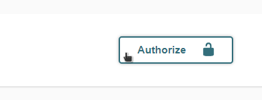
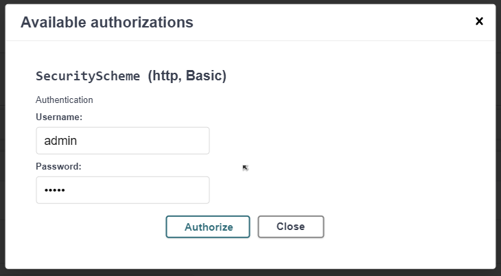

# Employee System Project

This is a demo project to showcase the architectural depth. Uncle Bob's clean architecture has been taken as inspiration for this design here.

The _usecases_ are the the pure logic based code. The _in_ contains all code going into the usecases. Eg. controllers. The _out_ are all the code that goes outside from the usecase. Eg. Repositories.  

## Pre requisites

- Docker (and also, docker-compose) is installed
- `JAVA_HOME` is set. `$JAVA_HOME/bin` (`%JAVA_HOME%\bin` for windows) is added to the path.
- A wrapper maven is provided incase maven is not installed. mvnw should have the executable rights.
- Check if proxies for maven and docker are configured, if present.

### Clone the project

```shell script
git clone https://github.com/pricelessjunk/personio.git
```

### Run tests

```shell script
> docker-compose up personio-postgres   # Start the db in port 5433
> ./mvnw test                           # db needed for the integration tests
```

### Run Service

```shell script
> ./mvnw clean package -DskipTests
> docker-compose up --build
```

This starts the postgres database in the background and the employee service.

Note: The tests are skipped at the packaging stage as the integration tests will fail due to absence of the database. If the database docker is running in the back, the skiptests can be ignored.

### Start the application

- Go to the Swagger Ui:  [http://localhost:8080/q/swagger-ui/](http://localhost:8080/q/swagger-ui/)
- Click on authorize in the _top right corner_

    

- Login using _admin/admin_. (See list of all users and role below)

    

- There are two links available.
    - To Post the structure
    - To get the supervisor

### List of users

| id    | Password | Role       | Note                      |
|-------|----------|------------|---------------------------|
| admin | admin    | Admin, User| Can access all links      |
| user  | user     | User       | Cannot access any of them |
